# 在线销售平台 - 系统架构图

> **创建时间**: 2025-01-27  
> **系统概述**: 前后端分离的在线销售平台，支持商品管理、订单处理、支付、拼团等功能

---

## 📐 子图1：系统总体架构概览

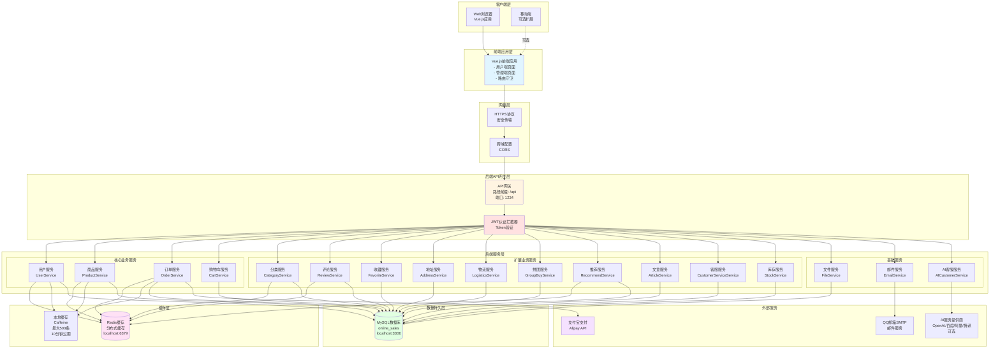

---

## 📐 子图2：前端应用架构

```mermaid
graph TB
    subgraph 前端应用 Vue.js
        subgraph 页面路由层
            Router[Vue Router<br/>路由守卫<br/>JWT验证]
        end
        
        subgraph 用户端页面
            HomePage[首页<br/>Home.vue]
            ProductList[商品列表<br/>Products.vue]
            ProductDetail[商品详情<br/>ProductDetail.vue]
            CategoryPage[分类页面<br/>Category.vue]
            CartPage[购物车<br/>Cart.vue]
            OrderPage[订单管理<br/>Order.vue]
            UserCenter[用户中心<br/>UserCenter.vue]
            FavoritePage[我的收藏<br/>Favorite.vue]
            ArticlePage[资讯文章<br/>Article.vue]
            ArticleDetail[文章详情<br/>ArticleDetail.vue]
            SearchPage[搜索页面<br/>Search.vue]
            GroupBuyList[拼团列表<br/>GroupBuyList.vue]
            GroupBuyDetail[拼团详情<br/>GroupBuyDetail.vue]
            MyGroupBuy[我的拼团<br/>MyGroupBuy.vue]
            RecommendCenter[推荐中心<br/>RecommendCenter.vue]
        end
        
        subgraph 管理端页面
            ShowView[后台首页<br/>showView.vue]
            UserManager[用户管理<br/>UserManager.vue]
            ProductManager[商品管理<br/>ProductManager.vue]
            CategoryManager[分类管理<br/>CategoryManager.vue]
            OrderManager[订单管理<br/>OrderManager.vue]
            CartManager[购物车管理<br/>CartManager.vue]
            ReviewManager[评论管理<br/>ReviewManager.vue]
            ArticleManager[文章管理<br/>ArticleManager.vue]
            CarouselManager[轮播图管理<br/>CarouselManager.vue]
            StockInManager[入库管理<br/>StockInManager.vue]
            StockOutManager[出库管理<br/>StockOutManager.vue]
            LogisticsManager[物流管理<br/>LogisticsManager.vue]
            GroupBuyManager[拼团管理<br/>GroupBuyManager.vue]
            CustomerServiceHistory[客服历史<br/>CustomerServiceHistory.vue]
            NoticeList[公告列表<br/>NoticeList.vue]
        end
        
        subgraph 认证页面
            Login[登录页面<br/>Login.vue]
            Register[注册页面<br/>RegisterVue.vue]
            Forget[忘记密码<br/>Forget.vue]
        end
        
        subgraph 组件层
            Header[Header组件<br/>头部导航]
            Aside[Aside组件<br/>侧边栏]
            ProductCard[ProductCard组件<br/>商品卡片]
            Pagination[Pagination组件<br/>分页组件]
            BreadCrumbs[BreadCrumbs组件<br/>面包屑]
            Upload[Upload组件<br/>文件上传]
            AvatarUploader[AvatarUploader组件<br/>头像上传]
            FrontHeader[FrontHeader组件<br/>前台头部]
            FrontFooter[FrontFooter组件<br/>前台底部]
            FrontCarousel[FrontCarousel组件<br/>轮播图]
            FrontCategory[FrontCategory组件<br/>分类导航]
            CustomerServiceWidget[CustomerServiceWidget组件<br/>客服组件]
        end
        
        subgraph 状态管理
            Store[Vuex Store<br/>全局状态管理]
        end
        
        subgraph 工具层
            Request[Request工具<br/>Axios封装<br/>请求拦截]
            Logger[Logger工具<br/>日志记录]
            EventBus[EventBus工具<br/>事件总线]
            TimeUtil[Time工具<br/>时间处理]
            ExcelUtil[Excel工具<br/>Excel导出]
        end
        
        subgraph API接口
            API[API调用<br/>Base URL: http://localhost:1234/api]
        end
    end
    
    Router --> HomePage
    Router --> ProductList
    Router --> ProductDetail
    Router --> CategoryPage
    Router --> CartPage
    Router --> OrderPage
    Router --> UserCenter
    Router --> FavoritePage
    Router --> ArticlePage
    Router --> ArticleDetail
    Router --> SearchPage
    Router --> GroupBuyList
    Router --> GroupBuyDetail
    Router --> MyGroupBuy
    Router --> RecommendCenter
    Router --> ShowView
    Router --> UserManager
    Router --> ProductManager
    Router --> CategoryManager
    Router --> OrderManager
    Router --> Login
    Router --> Register
    Router --> Forget
    
    HomePage --> FrontHeader
    HomePage --> FrontCarousel
    HomePage --> FrontCategory
    HomePage --> ProductCard
    ProductList --> ProductCard
    ProductList --> Pagination
    ProductList --> BreadCrumbs
    
    Login --> API
    Register --> API
    ProductList --> API
    CartPage --> API
    OrderPage --> API
    
    API --> Request
    Request --> Logger
    Request --> Store
    
    style Router fill:#e1f5ff
    style Store fill:#fff4e1
    style Request fill:#ffe1e1
    style API fill:#e1ffe1
```

---

## 📐 子图3：后端API网关与认证流程

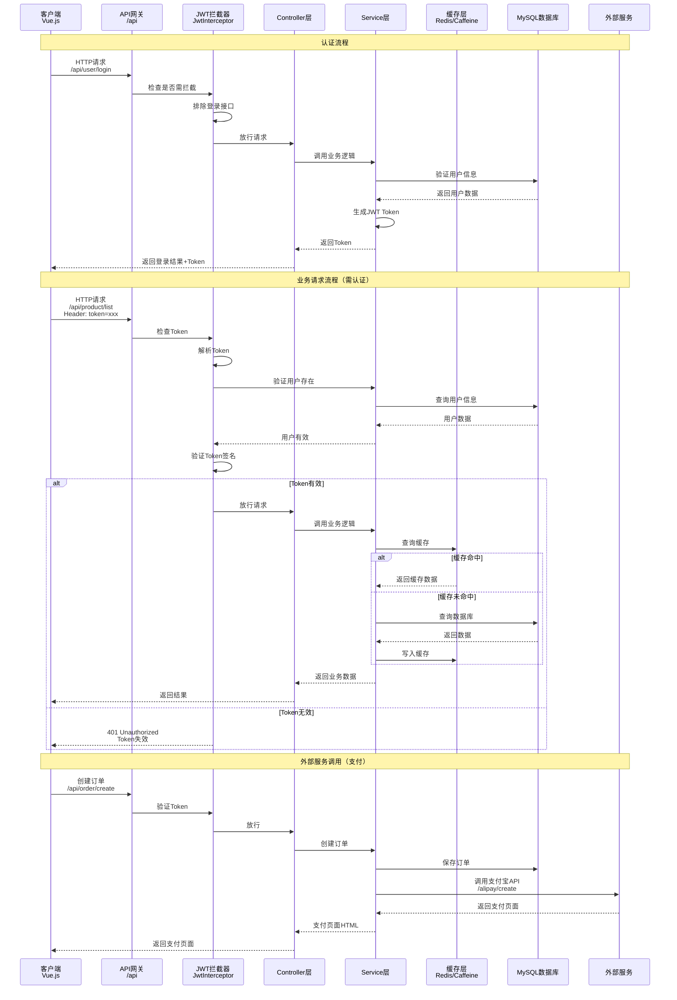

---

## 📐 子图4：核心业务服务架构

```mermaid
graph TB
    subgraph Controller层
        UserController[UserController<br/>用户管理]
        ProductController[ProductController<br/>商品管理]
        OrderController[OrderController<br/>订单管理]
        CartController[CartController<br/>购物车管理]
        CategoryController[CategoryController<br/>分类管理]
        GroupBuyController[GroupBuyController<br/>拼团管理]
        AlipayController[AlipayController<br/>支付管理]
    end
    
    subgraph Service层
        UserService[UserService<br/>用户业务逻辑]
        ProductService[ProductService<br/>商品业务逻辑]
        OrderService[OrderService<br/>订单业务逻辑]
        CartService[CartService<br/>购物车业务逻辑]
        CategoryService[CategoryService<br/>分类业务逻辑]
        GroupBuyService[GroupBuyService<br/>拼团业务逻辑]
        AlipayService[AlipayService<br/>支付业务逻辑]
    end
    
    subgraph Mapper层
        UserMapper[UserMapper<br/>用户数据访问]
        ProductMapper[ProductMapper<br/>商品数据访问]
        OrderMapper[OrderMapper<br/>订单数据访问]
        CartMapper[CartMapper<br/>购物车数据访问]
        CategoryMapper[CategoryMapper<br/>分类数据访问]
        GroupBuyMapper[GroupBuyMapper<br/>拼团数据访问]
    end
    
    subgraph 缓存层
        Redis[(Redis<br/>分布式缓存)]
        Caffeine[本地缓存<br/>Caffeine]
    end
    
    subgraph 数据库层
        MySQL[(MySQL数据库<br/>online_sales)]
        subgraph 核心表
            UserTable[(用户表<br/>user)]
            ProductTable[(商品表<br/>product)]
            OrderTable[(订单表<br/>order)]
            CartTable[(购物车表<br/>cart)]
            CategoryTable[(分类表<br/>category)]
            GroupBuyTable[(拼团表<br/>group_buy)]
            StockTable[(库存表<br/>stock)]
        end
    end
    
    subgraph 外部服务
        AlipayAPI[支付宝API<br/>支付服务]
    end
    
    UserController --> UserService
    ProductController --> ProductService
    OrderController --> OrderService
    CartController --> CartService
    CategoryController --> CategoryService
    GroupBuyController --> GroupBuyService
    AlipayController --> AlipayService
    
    UserService --> UserMapper
    ProductService --> ProductMapper
    OrderService --> OrderMapper
    CartService --> CartMapper
    CategoryService --> CategoryMapper
    GroupBuyService --> GroupBuyMapper
    
    UserService --> Redis
    ProductService --> Redis
    OrderService --> Redis
    CategoryService --> Redis
    GroupBuyService --> Redis
    
    ProductService --> Caffeine
    OrderService --> Caffeine
    
    UserMapper --> UserTable
    ProductMapper --> ProductTable
    OrderMapper --> OrderTable
    CartMapper --> CartTable
    CategoryMapper --> CategoryTable
    GroupBuyMapper --> GroupBuyTable
    ProductMapper --> StockTable
    
    AlipayService --> AlipayAPI
    OrderService --> AlipayService
    
    style Controller fill:#e1f5ff
    style Service fill:#fff4e1
    style Mapper fill:#ffe1e1
    style MySQL fill:#e1ffe1
    style Redis fill:#ffe1f5
    style AlipayAPI fill:#f5e1ff
```

---

## 📐 子图5：订单与支付流程

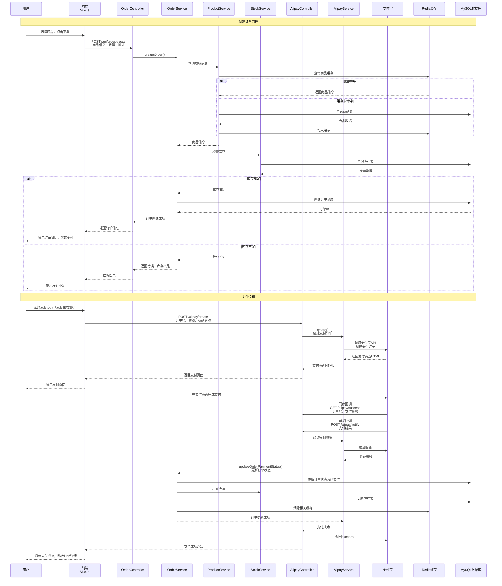

---

## 📐 子图6：缓存策略架构

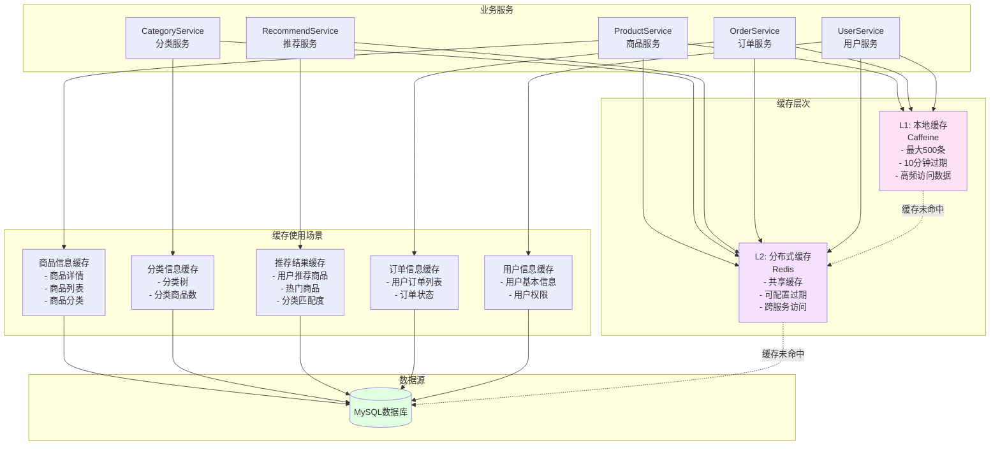

---

## 📐 子图7：外部服务集成架构

```mermaid
graph TB
    subgraph 后端服务
        AlipayService[AlipayService<br/>支付宝服务]
        EmailService[EmailService<br/>邮件服务]
        AICustomerService[AICustomerService<br/>AI客服服务]
        FileService[FileService<br/>文件服务]
    end
    
    subgraph 支付服务
        AlipayAPI[支付宝开放平台<br/>Alipay API]
        subgraph 支付功能
            CreatePay[创建支付订单<br/>FAST_INSTANT_TRADE_PAY]
            RefundPay[支付退款<br/>AlipayTradeRefund]
            Callback[支付回调<br/>同步/异步回调]
        end
    end
    
    subgraph 邮件服务
        QQSMTPServer[QQ邮箱SMTP服务器<br/>smtp.qq.com:587]
        subgraph 邮件功能
            SendEmail[发送邮件<br/>验证码/通知]
            VerifyCode[验证码服务<br/>VerificationCodeService]
        end
    end
    
    subgraph AI服务（可选）
        subgraph AI服务提供商
            OpenAI[OpenAI<br/>GPT-3.5/GPT-4]
            BaiduAI[百度文心<br/>ERNIE-Bot]
            AlibabaAI[阿里通义<br/>Qwen系列]
            TencentAI[腾讯混元<br/>Hunyuan]
        end
        AIConfig[AI配置<br/>- provider选择<br/>- API密钥<br/>- 模型名称]
    end
    
    subgraph 文件存储
        LocalStorage[本地文件存储<br/>/files/img/]
        StaticResource[静态资源服务<br/>/static/**]
    end
    
    AlipayService --> AlipayAPI
    AlipayAPI --> CreatePay
    AlipayAPI --> RefundPay
    AlipayAPI --> Callback
    
    EmailService --> QQSMTPServer
    QQSMTPServer --> SendEmail
    EmailService --> VerifyCode
    
    AICustomerService --> AIConfig
    AIConfig --> OpenAI
    AIConfig --> BaiduAI
    AIConfig --> AlibabaAI
    AIConfig --> TencentAI
    
    FileService --> LocalStorage
    FileService --> StaticResource
    
    style AlipayAPI fill:#f5e1ff
    style QQSMTPServer fill:#e1f5ff
    style AIConfig fill:#fff4e1
    style LocalStorage fill:#ffe1e1
```

---

## 📋 架构说明

### 1. 系统架构特点

- **前后端分离**：Vue.js前端 + Spring Boot后端，通过RESTful API通信
- **JWT认证**：基于Token的无状态认证机制
- **多层缓存**：Caffeine本地缓存 + Redis分布式缓存
- **外部服务集成**：支付宝支付、邮件服务、AI客服等

### 2. 技术栈

**前端**：
- Vue.js 3
- Vue Router（路由管理）
- Vuex（状态管理）
- Axios（HTTP客户端）
- Element Plus（UI组件库）

**后端**：
- Spring Boot（Java 17）
- MyBatis Plus（ORM框架）
- Spring Security（安全框架）
- JWT（认证）
- Redis（分布式缓存）
- Caffeine（本地缓存）

**数据库**：
- MySQL 8.0

**外部服务**：
- 支付宝开放平台
- QQ邮箱SMTP
- AI服务（OpenAI/百度/阿里/腾讯，可选）

### 3. 核心功能模块

- **用户管理**：注册、登录、个人信息管理
- **商品管理**：商品CRUD、分类管理、库存管理
- **购物车**：添加、删除、批量操作
- **订单管理**：创建订单、支付、退款、物流跟踪
- **拼团功能**：创建拼团、加入拼团、拼团管理
- **推荐系统**：个性化推荐、热门推荐
- **评论系统**：商品评论、评价管理
- **文章管理**：资讯文章发布、管理
- **客服系统**：人工客服、AI客服（可选）

### 4. 安全机制

- **JWT Token认证**：所有API请求（除登录、注册等公开接口）需要Token验证
- **HTTPS传输**：建议生产环境使用HTTPS
- **SQL注入防护**：使用MyBatis参数化查询
- **XSS防护**：前端输入验证和后端数据过滤

### 5. 性能优化

- **缓存策略**：多级缓存，减少数据库访问
- **数据库索引**：关键字段建立索引
- **分页查询**：列表数据使用分页
- **异步处理**：非关键操作使用异步处理

---

---

## 📐 子图11：核心实体类图

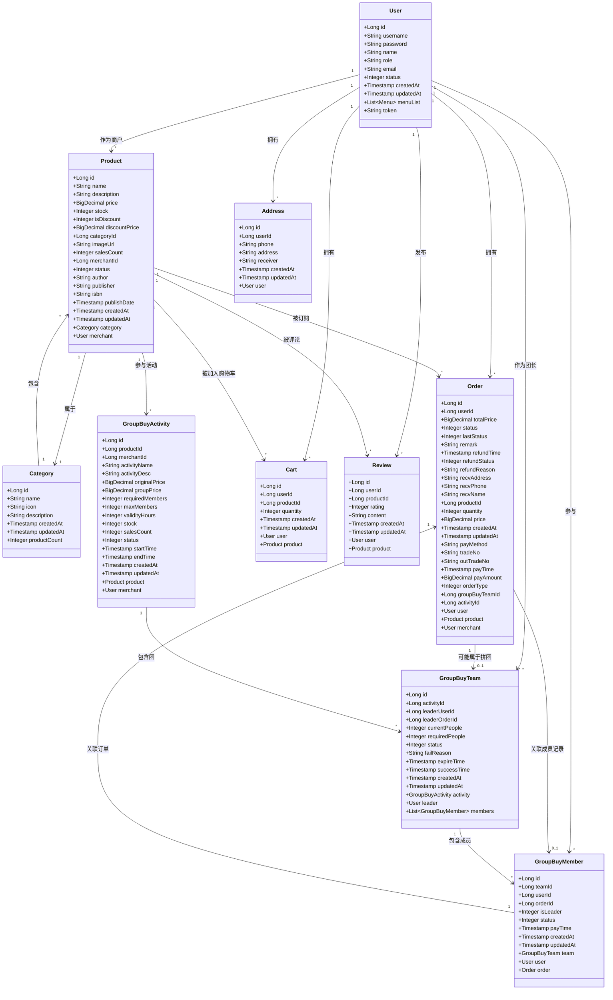

---

## 📐 子图12：三层架构类图（Controller-Service-Mapper）

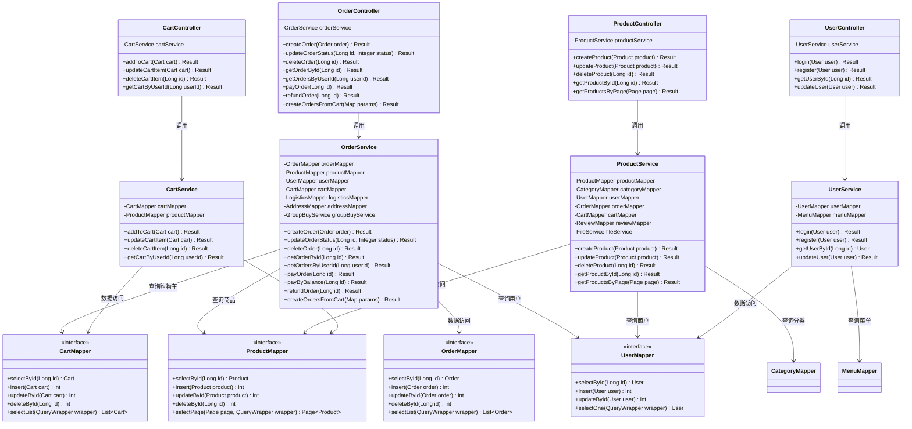

---

## 📐 子图13：购物车结算流程时序图

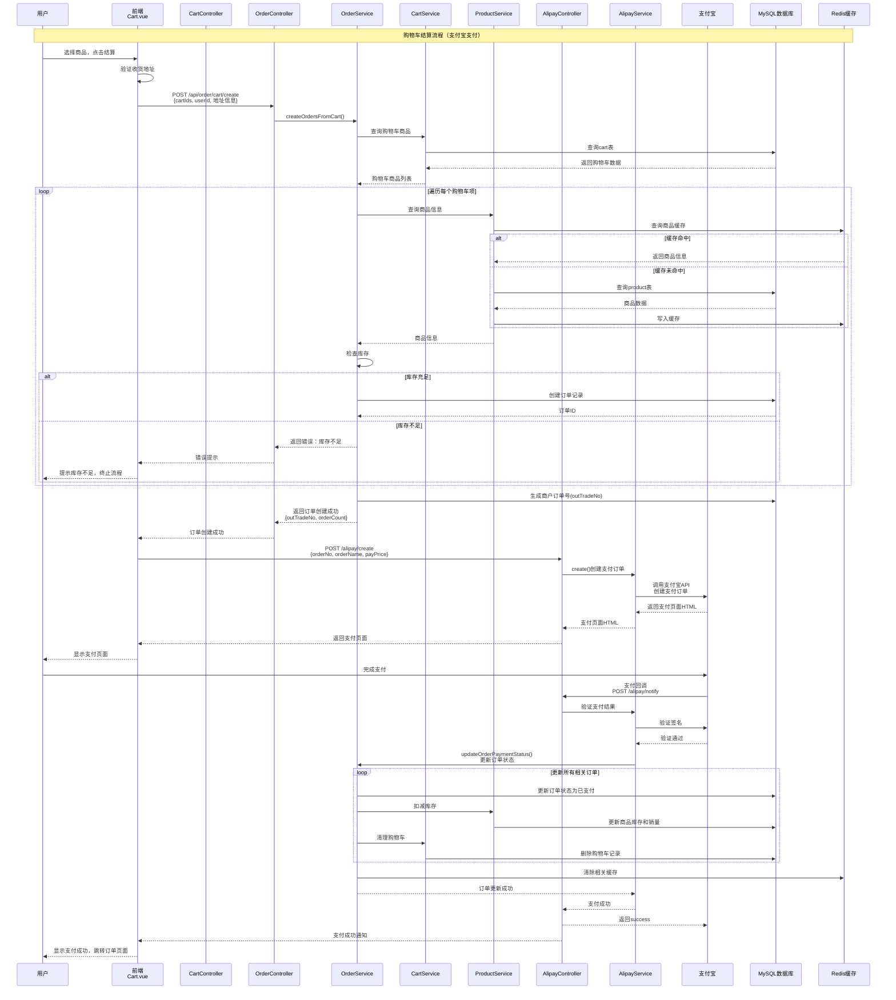

---

## 📐 子图14：拼团流程时序图

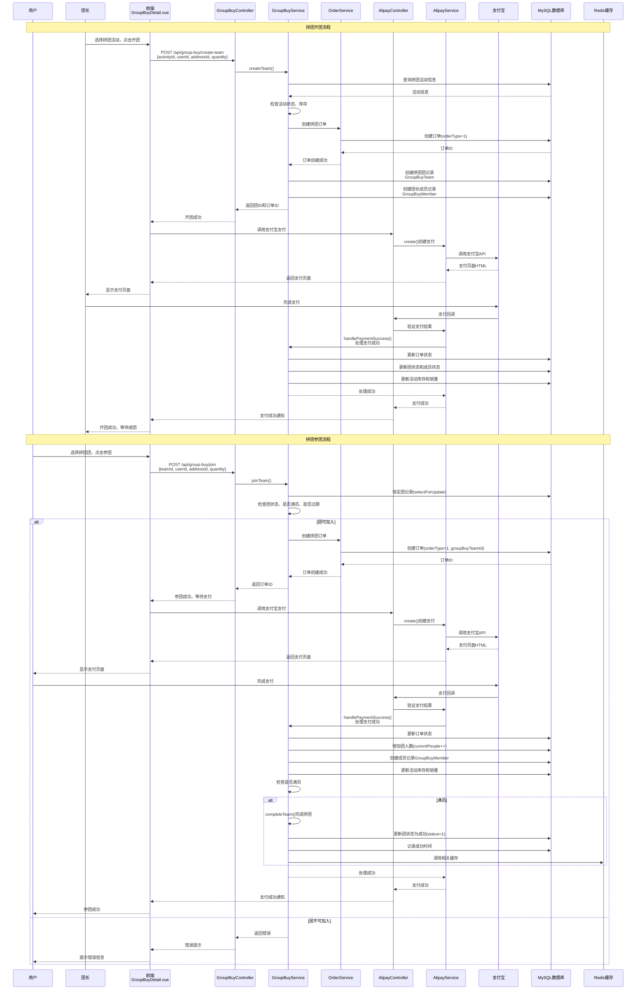

---

## 📐 子图15：用户注册登录流程时序图

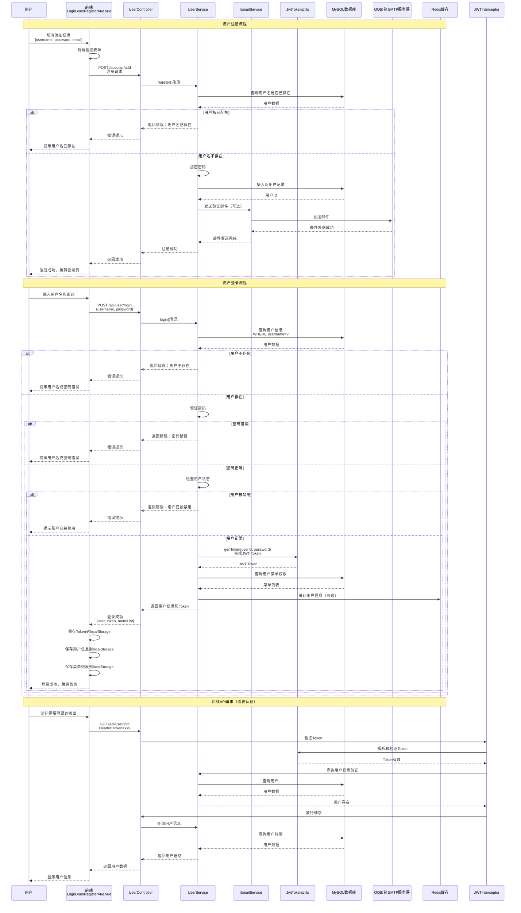

---

*文档创建时间：2025-01-27*
*架构图使用 Mermaid 格式绘制，可在支持 Mermaid 的 Markdown 编辑器中查看*

---

## 📐 子图8：推荐系统架构

```mermaid
graph TB
    subgraph 前端推荐中心
        RecommendCenterPage[推荐中心页面<br/>RecommendCenter.vue]
        CategoryMatchView[分类匹配度展示<br/>首页/推荐页组件]
        AlgorithmSetting[算法权重设置UI<br/>权重滑块/Tab切换]
    end
    
    subgraph 前端推荐API调用
        RecommendAPI[/GET /api/recommend/user/{userId}/explanation<br/>可选参数: algorithmType, weights/]
        CategoryMatchAPI[/GET /api/recommend/category-matches/{userId}/]
    end
    
    subgraph 后端推荐服务
        RecommendController[RecommendController]
        RecommendService[RecommendService<br/>推荐业务逻辑]
        StatisticsService[StatisticsService<br/>统计分析]
    end
    
    subgraph 推荐算法层
        AlgoPersonal[个性化推荐<br/>Personalized]
        AlgoCollaborative[协同过滤<br/>Collaborative]
        AlgoContent[内容相似度<br/>Content-based]
        AlgoTrending[热门趋势<br/>Trending]
        AlgoSerendipity[偶然性推荐<br/>Serendipity]
        AlgoMixer[权重混合器<br/>权重合成]
    end
    
    subgraph 数据与缓存
        Redis[(Redis缓存<br/>推荐结果/分类匹配度)]
        MySQL[(MySQL<br/>订单、收藏、浏览记录)]
    end
    
    RecommendCenterPage --> RecommendAPI
    RecommendCenterPage --> AlgorithmSetting
    CategoryMatchView --> CategoryMatchAPI
    
    RecommendAPI --> RecommendController
    CategoryMatchAPI --> RecommendController
    
    RecommendController --> RecommendService
    RecommendService --> StatisticsService
    
    RecommendService --> Redis
    RecommendService --> MySQL
    StatisticsService --> MySQL
    
    RecommendService --> AlgoMixer
    AlgoMixer --> AlgoPersonal
    AlgoMixer --> AlgoCollaborative
    AlgoMixer --> AlgoContent
    AlgoMixer --> AlgoTrending
    AlgoMixer --> AlgoSerendipity
    
    AlgoPersonal --> MySQL
    AlgoCollaborative --> MySQL
    AlgoContent --> MySQL
    AlgoTrending --> MySQL
    
    RecommendService --> Redis
    
    style RecommendCenterPage fill:#e1f5ff
    style RecommendController fill:#e1f5ff
    style RecommendService fill:#fff4e1
    style AlgoMixer fill:#ffe1f5
    style Redis fill:#f5e1ff
    style MySQL fill:#e1ffe1
```

---

## 📐 子图9：客服与 AI 客服架构

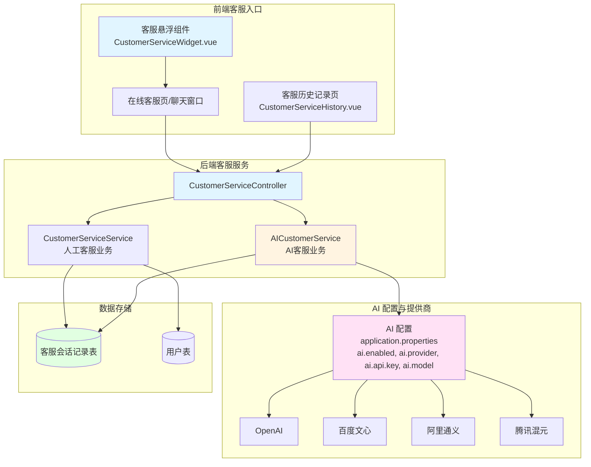

---

## 📐 子图10：统计与报表架构

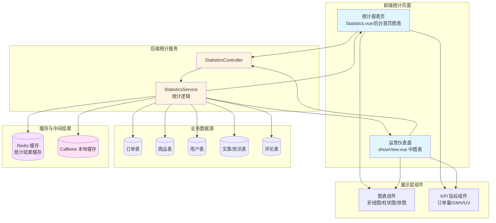

